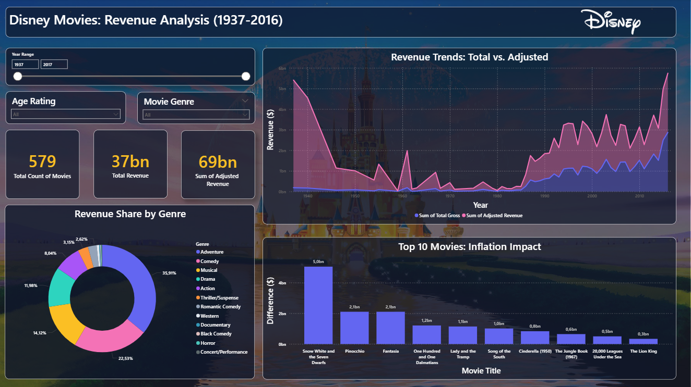
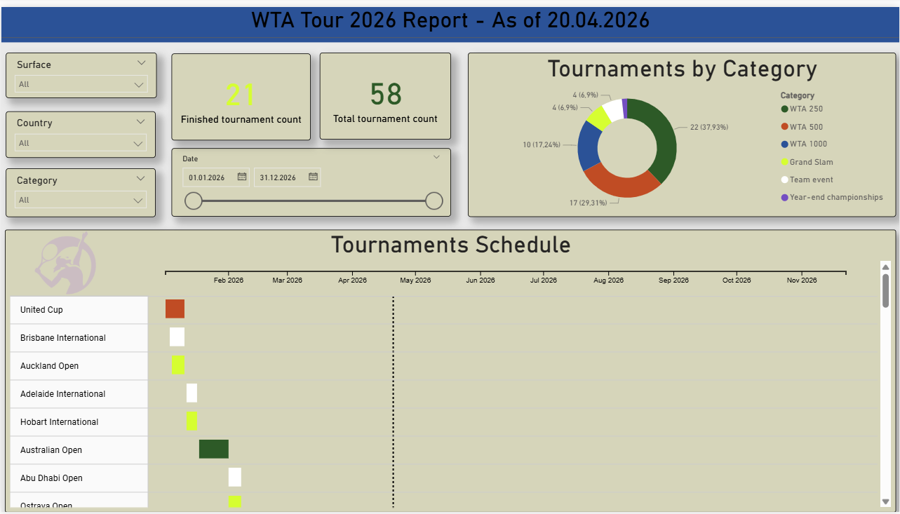

# 🪄 Disney Studios: Revenue Analysis (Inflation Adjusted)

### 🌟 Project Overview
This Power BI report blends business analytics with the magical world of Disney. The goal of this project was to analyze which film genres have contributed the most to the studio's total real income over the years, specifically using **inflation-adjusted** figures to ensure a fair comparison between classic masterpieces and modern blockbusters.

The design follows a **"Midnight Magic"** aesthetic—utilizing deep navies, sparkling golds, and a modern *Glassmorphism* style (frosted glass effect) to create a premium, whimsical experience.

---

### 📸 Dashboard Preview


---

### 📊 Key Features
- **Genre Analysis:** Dynamic percentage breakdown of revenue, automatically excluding "Unknown" or "Blank" categories.
- **Inflation Adjustment:** All financial metrics are calculated based on the `inflation_adjusted_gross` column, allowing for historical accuracy.
- **Custom Whimsical Theme:** A bespoke color palette inspired by Disney's heritage (Midnight Indigo, Pixie Pink, Enchanted Gold).
- **Glassmorphic UI:** Rounded containers with 95% transparency and soft "glow" shadows for a floating, magical feel.

---

### 🛠️ Technology & DAX Logic
To ensure the "Percentage of Total" remains accurate even when "Unknown" genres are filtered out, the following DAX measure was implemented:

**Core Percentage Measure:**
```dax
% of Genre Contribution = 
DIVIDE(
    SUM('Disney_Data'[inflation_adjusted_gross]), 
    CALCULATE(
        SUM('Disney_Data'[inflation_adjusted_gross]), 
        ALLSELECTED('Disney_Data'[genre])
    )
)
```

# 🪄 WTA Tour 2026: Tournaments Scgedule

### 📸 Dashboard Preview


